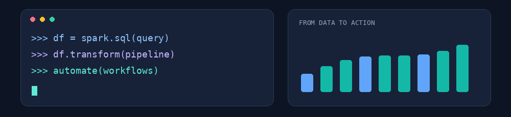

```html
<div align="center">



# Hi, I'm Davi Milhome 👋

** Data Engineering Enthusiast | Python & SQL**

Turning complex data into reliable solutions, meaningful insights and better decisions.

<a href="https://www.linkedin.com/in/davi-milhome/"></a>&nbsp;
<a href="mailto:davimmilhome@gmail.com"></a>

</div>

### About me

I'm a **Data professional** with experience in business intelligence, data processing and automation.

My professional background spans **financial services and consumer goods**, where I've worked on transforming raw data into actionable insights, building analytical solutions and automating processes.

I work primarily with **Python, SQL, PySpark, Databricks and Power BI**, handling everything from data transformation and business logic to analytical models, dashboards and performance indicators.

### My everyday toolkit

<table>
  <tr>
    <td align="center" width="25%"><br /><sub>Data & automation</sub></td>
    <td align="center" width="25%"><br /><sub>Data processing</sub></td>
    <td align="center" width="25%"><br /><sub>Queries & transformations</sub></td>
    <td align="center" width="25%"><br /><sub>Data workflows</sub></td>
  </tr>
</table>


Feel free to connect with me on [LinkedIn](https://www.linkedin.com/in/davi-milhome/) or reach out by [email](mailto:davimmilhome@gmail.com).

```

